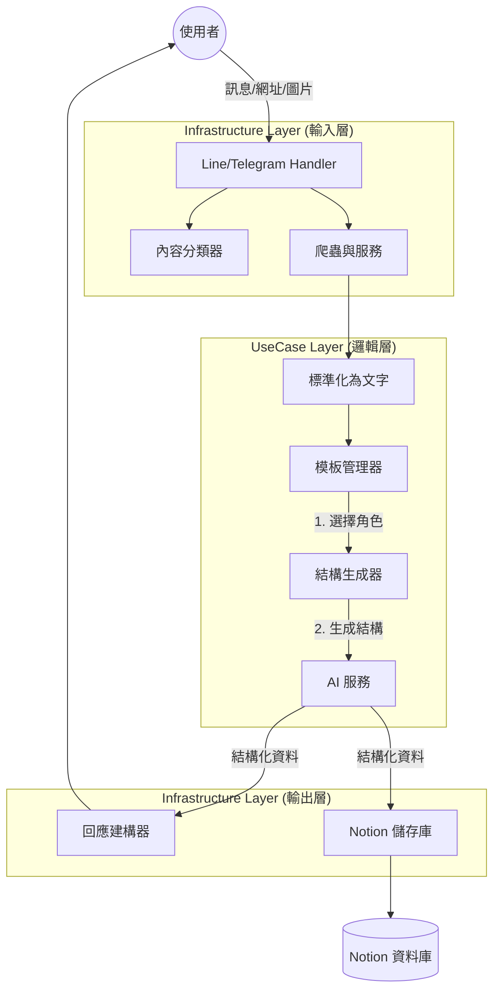

# 🏗️ 系統架構與資料流解說

這份文件說明 **Line Bot Content Saver** 如何處理不同類型的輸入資料，以及 Notion 模板如何驅動 AI 的行為。

## 1. 高層次資料流 (High-Level Data Flow)

本系統採用 **Clean Architecture (潔淨架構)**，資料流經定義嚴謹的各個層級：`Infrastructure` (外部輸入) → `UseCase` (業務邏輯) → `Domain` (核心資料) → `Infrastructure` (外部輸出)。



---

## 2. 詳細處理流程 (Detailed Processing Pipeline)

### 第一步：輸入標準化 (Input Normalization)
無論輸入類型為何，系統首先將其轉換為標準化的 **文字情境 (Text Context)** 供 AI 使用。

| 輸入類型 | 處理元件 | 提取資料 |
|------------|---------------------|----------------|
| **📝 文字** | 直接處理 | 原始文字 |
| **🔗 網址** | `WebScraper` | 網頁標題 + 主要內容 (Markdown) |
| **📱 社群** | `ApifyScraper` | 貼文內容 + 作者 + 按讚/留言數 |
| **📺 YouTube** | `YouTubeService` | **字幕** (優先) 或 描述 + 時長/頻道 |
| **🎙️ 語音** | `WhisperService` | 轉錄文字 + 時長 |
| **🖼️ 圖片** | `VisionService` | 圖片描述 (透過 Vision API 分析) |

### 第二步：智慧模板匹配 (Intelligent Template Matching)
取得 **文字情境** 後，`PromptTemplateManager` 決定要 *如何* 處理它。

1.  **載入模板**：從 Notion 讀取目前啟用的模板 (有快取機制)。
2.  **關鍵字匹配**：掃描文字中是否包含 Notion 定義的關鍵字 (例如出現 "API", "Python" -> 匹配 **科技分析**)。
3.  **預設回退**：若無關鍵字匹配，則使用預設的 **"一般摘要" (Lifestyle)**。

### 第三步：動態結構生成 (Dynamic Schema Generation)
這是系統的「大腦」。它根據 **Notion 模板設定** 來決定輸出的 JSON 結構。

*   **情境 A：固定格式** (例如 `Output Format` = "行動清單")
    *   系統使用寫死的 JSON Schema (標題, 標籤, 行動項目)。
*   **情境 B：自動推斷** (例如 `Output Format` = "自動推斷")
    *   **輸入**：角色定義 (來自 Notion Prompt) + 內容預覽。
    *   **過程**：詢問 AI，*"基於這個角色和內容，最好的 JSON 結構是什麼？"*
    *   **輸出**：動態生成的 JSON Schema (例如針對「財經」，可能會生成 `市場趨勢`, `風險因素` 等欄位)。

### 第四步：AI 執行 (Structured Output)
系統向 AI 提供者 (Gemini/OpenAI) 發送請求：

```json
{
  "role": "你是一位專業的科技分析師...", // 來自 Notion 'Prompt'
  "content": "提取出的文字內容...",
  "schema": { ... } // 來自第三步
}
```

AI 會回傳嚴格遵守該 Schema 的 **JSON 物件**。

### 第五步：雙向輸出 (Dual Output)
1.  **給使用者**：`ResponseBuilder` 將 JSON 格式化為易讀的介面 (Line/Telegram 訊息)。
2.  **存入 Notion**：`NotionRepository` 將 JSON 欄位映射至 Notion 資料庫的屬性。

---

## 3. Notion 模板整合 (Notion Template Integration)

**Notion Template 資料庫** 控制了 AI 的兩個核心面向：**人格 (角色)** 與 **結構 (Schema)**。

### 欄位說明

| 欄位 | 程式內部名稱 | 功能 | 對 AI 的影響 |
|--------|---------------|----------|--------------|
| **Name** | `name` | 識別名稱 | 用於紀錄和除錯。 |
| **Keywords** | `keywords` | 觸發詞 | 若輸入內容包含這些詞，就會選用此模板。 |
| **Prompt** | `prompt` | **角色定義** | 定義 AI **"是誰"** (例："心理學家")。設定語氣和視角。 |
| **Output Format** | `output_format` | **結構控制** | 定義資料 **"長怎樣"**。<br>• **自動推斷**：根據內容動態生成欄位。<br>• **標準摘要**：使用標準欄位。 |

### 範例：「心理分析」模板

*   **Prompt**：*"你是一位專業心理諮商師。請分析這段話潛在的情緒..."*
*   **Output Format**：*"自動推斷"*
*   **結果流程**：
    1.  使用者傳送一段關於工作壓力的抱怨。
    2.  系統偵測到關鍵字 "焦慮", "壓力"。
    3.  選用「心理分析」模板。
    4.  `SchemaGenerator` 讀取 Prompt，生成包含 `情緒狀態`, `壓力源`, `應對機制` 的 Schema。
    5.  AI 填入這些特定欄位。
    6.  使用者收到一份結構化的心理分析報告，而不僅僅是摘要。
